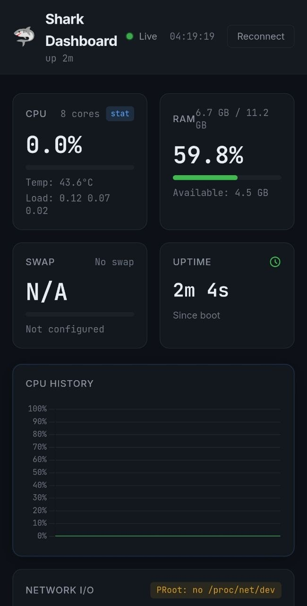

# 🦈 Shark Dashboard

**An ultra-lightweight, zero-config, zero-dependency, edge-native monitoring dashboard built with Go, HTMX, and SSE.**

Designed specifically for extreme environments like **Termux / PRoot on Android**, Raspberry Pi, and low-resource Edge servers. It consumes **< 10MB RAM**, requires ~0.4% CPU, and gracefully handles restricted kernel syscalls where heavy solutions like Netdata or Prometheus crash.


---

## 📸 Screenshots

<details>
<summary>📱 Mobile View (Termux Edge Node)</summary>
<br>
<div align="center">
  
  
</div>
</details>

<details>
<summary>💻 Desktop View (Monitoring Hub)</summary>
<br>

</details>

---

## 🚀 Why Shark Dashboard?

Traditional monitoring tools are too heavy for mobile-as-a-server setups (like Android running Debian via PRoot). They fork processes, rely on `systemd` (which doesn't exist in PRoot), and crash when Android's kernel restricts access to `/proc/net/dev`.

**Shark Dashboard solves this:**
- **Zero Configuration — Just Works:** Deploy on any device and it automatically discovers your environment. Detects battery status (charging/discharging), memory, swap, CPU temperature, Supervisor-managed processes — no config files, no setup. Install and go.
- **Zero Dependencies:** Compiles to a single static binary with embedded HTML (`go:embed`). No external assets.
- **Defensive Programming:** Graceful fallbacks for restricted Android environments. If `/proc/stat` is spoofed or restricted, it falls back to `/proc/loadavg`. If network stats are blocked, the UI degrades elegantly without crashing.
- **Battery & Thermal Friendly:** Designed for mobile chips. Built with `GOGC=200` to minimize Garbage Collection spikes. Collects data in a background goroutine (`sync.RWMutex`) to prevent data races and reduce I/O.
- **Real-Time SSE:** Uses Server-Sent Events (SSE) instead of WebSockets for lower overhead and auto-reconnection.
- **Supervisord Native:** Built-in XML-RPC client connects directly to `supervisord` TCP sockets to manage background processes.

## 🛠️ Tech Stack
- **Backend:** Go (Golang), `golang.org/x/sys/unix`
- **Frontend:** HTML5, HTMX (No heavy JS frameworks)
- **Styling:** Custom CSS (GitHub Dark Theme, Glassmorphism)

## 📦 Installation & Build

For ARM64 environments (e.g., Termux/PRoot on Android):

```bash
# Clone the repository
git clone https://github.com/Sereban-glitch/shark-dashboard.git
cd shark-dashboard

# Build with limited parallelism to prevent device overheating
go build -p 2 -ldflags="-s -w" -o shark-dashboard-arm64 main.go

# Run the dashboard
export GOGC=200 # Recommended to save battery
./shark-dashboard-arm64 -port 8081
```

## ⚙️ Configuration (Flags)

| Flag | Default | Description |
|------|---------|-------------|
| `-port` | `8081` | HTTP server port |
| `-addr` | `0.0.0.0` | Binding address |
| `-interval` | `3` | Metrics collection interval (seconds) |
| `-supervisor` | `http://127.0.0.1:9001` | Supervisord XML-RPC endpoint |

## 🌍 Real-World: Running on Redmi Note 9

Proven on a **Redmi Note 9 (Android 11, 4 GB RAM, MediaTek Helio G85)** running Debian via PRoot in Termux. Dashboard auto-detected:
- 🔋 **Battery state** — charging/discharging percentage in real time
- 🧠 **CPU temperature** — 8 cores, load average, thermal throttling visibility
- 💾 **RAM** — 3.8 GB detected, usage tracking helped identify memory leaks
- 📦 **Supervisor processes** — all running services automatically listed
- 🚨 **Error discovery** — spotted failing processes and resource bottlenecks that were invisible without real-time monitoring

Just drop the binary on any ARM64 Linux device and it works. No installation, no configuration.

## 🤝 Contributing

Pull requests are welcome! If you're building mobile-server infrastructure or IoT edge nodes, feel free to contribute.
