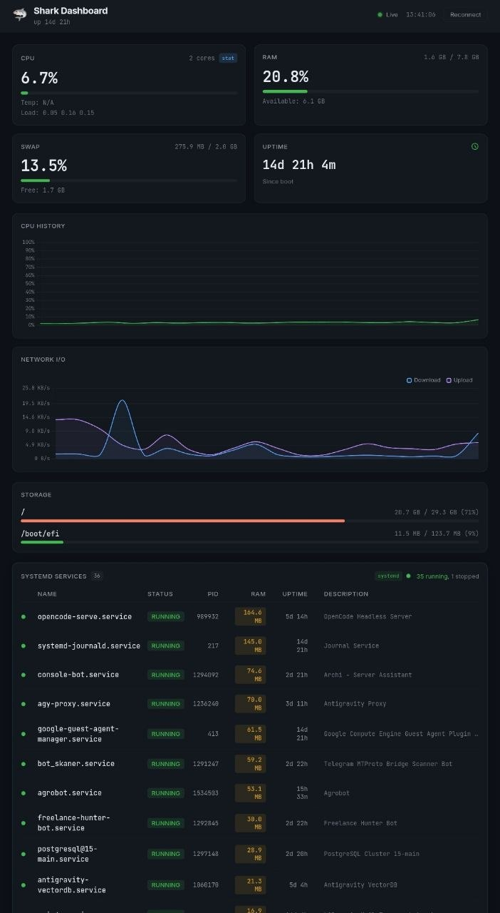
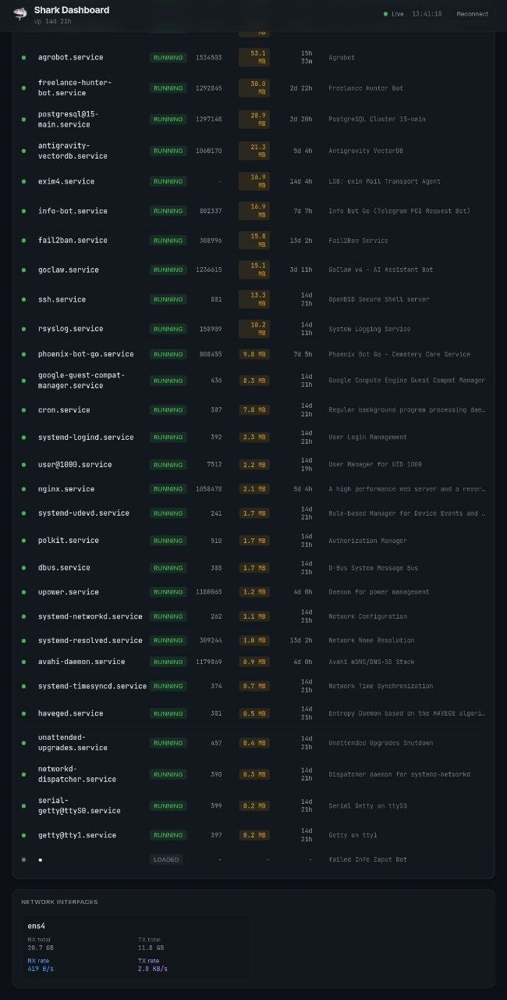
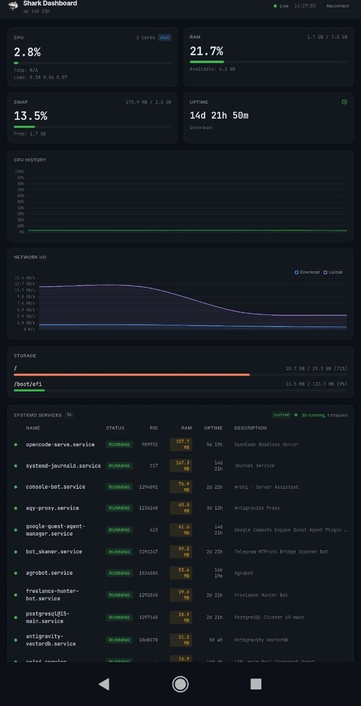
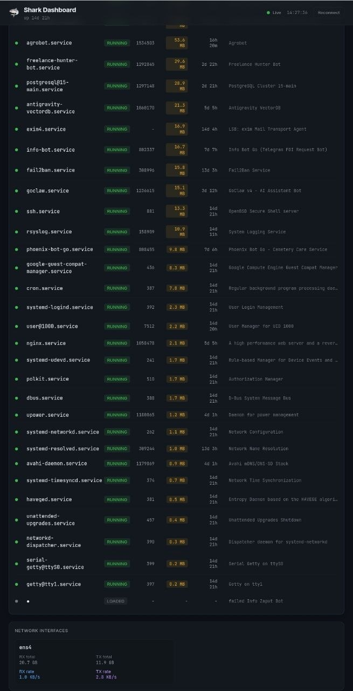

# 🦈 Shark Dashboard (v2.0 Universal)

**A drop-in, zero-dependency Web UI for profiling services on any Linux node. Built with Go, HTMX, and SSE.**


---

[](LICENSE)
[](https://golang.org)
[](https://github.com/Sereban-glitch/shark-dashboard/releases)

## 🚀 Быстрый старт

```bash
# Скачать бинарник
wget https://github.com/Sereban-glitch/shark-dashboard/releases/latest/download/shark-dashboard-linux-amd64
chmod +x shark-dashboard-linux-amd64
./shark-dashboard-linux-amd64

# Или через Docker
docker run -d -p 8080:8080 --name shark ghcr.io/sereban-glitch/shark-dashboard:latest

# Или из исходников
make build && ./shark-dashboard
```


## 🚀 The Problem It Solves

You just spun up a cloud VPS or an Edge device. You deployed a dozen microservices (Discord/Telegram bots, scrapers, APIs). Now you want to monitor their RAM consumption and status.
Setting up Prometheus + Node Exporter + Grafana is overkill. Staring at `htop` or `systemctl` in the terminal gets tedious.

**Enter Shark Dashboard:** A `<10MB` single static binary. Drop it on your server, run it, and instantly get a beautiful, real-time Web UI that auto-detects your stack. No configuration files. No dependencies.

## 📸 Screenshots (v2.0 UI)

<details>
<summary>💻 Desktop View (Smart RAM Sorting & Systemd Integration)</summary>
<br>
<div align="center">
  
  
  <br>
  <i>Notice the amber RAM capsules and automatic sorting (heaviest processes on top).</i>
</div>
</details>

<details>
<summary>📱 Mobile View (Termux Edge Node)</summary>
<br>
<div align="center">
  
  
</div>
</details>

---

## ✨ Key Features (v2.0)

- **Universal Process Auto-Discovery:** Automatically detects and monitors **Systemd**, **PM2**, and **Supervisord**. It finds your projects automatically.
- **Smart RAM Sorting:** Extracts precise memory consumption (via Linux cgroups or PM2 metrics) and automatically sorts processes. Memory leaks bubble up to the top of the list instantly.
- **Zero Configuration:** Auto-detects hardware topology (Cores, Temp, RAM, Swap, Disk, Network I/O). Install and go.
- **Defensive & Edge-Native:** Designed to survive restricted environments (like Android PRoot). If `/proc/stat` is locked by the kernel, it gracefully degrades to `/proc/loadavg` without crashing.
- **HTMX & SSE:** Real-time UI updates via Server-Sent Events. No heavy JavaScript frameworks (React/Vue).

## 🌍 Proven in the Wild

Shark Dashboard scales from enterprise clouds to pocket servers:
1. **Cloud Production (GCP / AWS):** Monitors 30+ mixed-language microservices (Go, Python, Node.js) on Google Cloud Platform Debian instances, exposing memory hogs in real-time.
2. **Mobile/IoT Edge Nodes:** Runs flawlessly on smartphones (e.g., Redmi Note 9 running Android 11 PRoot), consuming `< 0.4% CPU` thanks to aggressive Go Garbage Collector tuning (`GOGC=200`).

## 📦 Installation & Usage

```bash
# Clone and Build
git clone https://github.com/Sereban-glitch/shark-dashboard.git
cd shark-dashboard
go build -ldflags="-s -w" -o shark-dashboard main.go

# Run the dashboard (bind to localhost for security)
./shark-dashboard -port 8081 -addr 127.0.0.1
```

### 🔒 Security Note
Shark Dashboard is designed to be lightweight and does not include built-in authentication. **Do not expose it directly to the public internet.**
Best practice: Bind it to `127.0.0.1` and access it securely via an SSH tunnel:
`ssh -L 8081:127.0.0.1:8081 user@your-server-ip`

## 🤝 Contributing

Pull requests are welcome! If you're building mobile-server infrastructure or IoT edge nodes, feel free to contribute.
